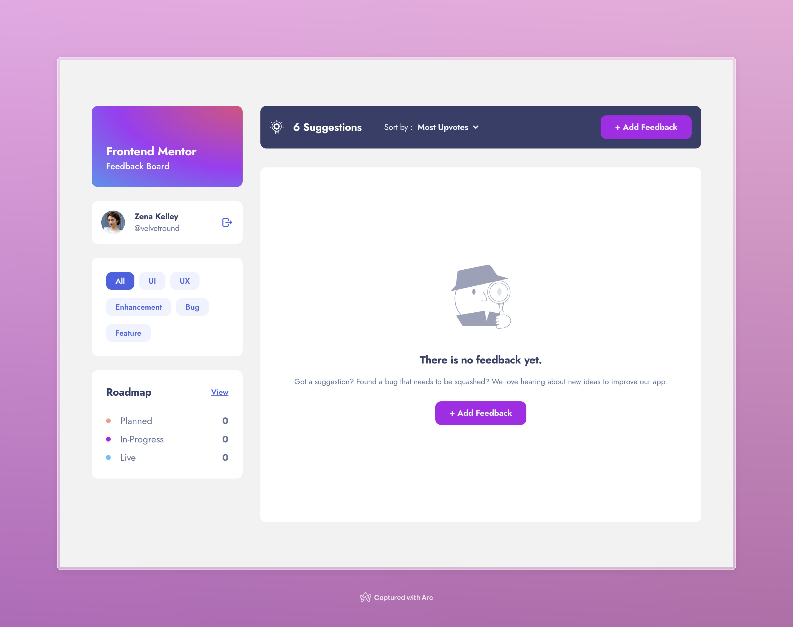

# Frontend Mentor - Product feedback app solution

This is a solution to the [Product feedback app challenge on Frontend Mentor](https://www.frontendmentor.io/challenges/product-feedback-app-wbvUYqjR6). Frontend Mentor challenges help you improve your coding skills by building realistic projects.

## Table of contents

- [Overview](#overview)
  - [The challenge](#the-challenge)
  - [Screenshot](#screenshot)
  - [Links](#links)
- [My process](#my-process)
  - [Built with](#built-with)
  - [What I learned](#what-i-learned)
  - [Continued development](#continued-development)
  - [Useful resources](#useful-resources)
- [Author](#author)
- [Acknowledgments](#acknowledgments)

## Overview

### The challenge

Users should be able to:

- View the optimal layout for the app depending on their device's screen size
- See hover states for all interactive elements on the page
- Create, read, update, and delete product feedback requests
- Receive form validations when trying to create/edit feedback requests
- Sort suggestions by most/least upvotes and most/least comments
- Filter suggestions by category
- Add comments and replies to a product feedback request
- Upvote product feedback requests
- **Bonus**: Keep track of any changes, even after refreshing the browser (`localStorage` could be used for this if you're not building out a full-stack app)

### Expected Behaviour

- Suggestions page
  - Only product feedback requests with a status of `suggestion` should be shown on the Suggestions page.
- Roadmap
  - Feedback requests with a status of `planned`, `in-progress`, or `live` should show up on the roadmap, and should be placed in the correct column based on their status.
  - Columns should be ordered by upvote totals.
- Creating a product request
  - When creating a new piece of feedback, an ID needs to be assigned which increments the current highest product request ID by 1.
  - The default status for a new piece of feedback is `suggestion`. This places it on the Suggestions page.
- Editing feedback
  - If a piece of feedback has its status updated to `planned`/`in-progress`/`live` it moves through to the roadmap and should show up in the correct column based on its new status.
- Add comments/replies
  - Use the data from the `currentUser` object in the `data.json` file to populate the user data for any new comments or replies.
  - Any comment/reply can have a maximum of 250 characters.

### Screenshot

### Links

- Solution URL: [Add solution URL here](https://your-solution-url.com)
- Live Site URL: [Add live site URL here](https://your-live-site-url.com)

## My process

### Built with

- Semantic HTML5 markup
- CSS custom properties
- Flexbox
- CSS Grid
- Mobile-first workflow
- [React](https://reactjs.org/) - JS library
- [Tailwind CSS](https://tailwindcss.com) - For styles

## Author

- Website - [Pradeep Kaswan](https://pradeepkaswan.co)
- Frontend Mentor - [@pradeepkaswan](https://www.frontendmentor.io/profile/pradeepkaswan)
- X - [@kaswanpradeep\_](https://www.x.com/kaswanpradeep_)
